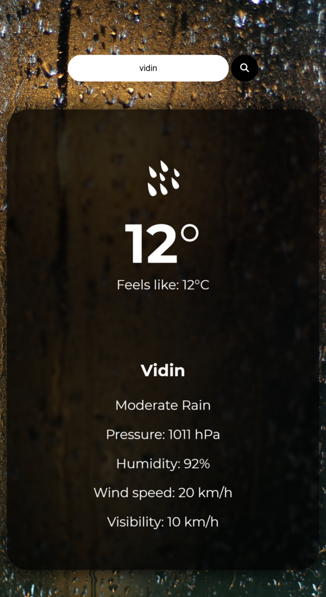

# Weather App
The web app is a weather application that allows users to check the current weather conditions of any location in the world. The app is built using HTML, CSS, and JavaScript, and utilizes the OpenWeather API to retrieve up-to-date weather data

Upon loading the app, users are presented with a search bar where they can enter the name of a city. After submitting their query, the app retrieves the corresponding weather data from the OpenWeather API and displays it to the user.

The weather data displayed includes the current temperature, humidity, wind speed, and a brief description of the weather conditions. Additionally, the app may display an icon and background image to represent the current weather conditions, such as a sun for clear skies or a cloud for overcast conditions.

Overall, this web app provides a simple and user-friendly way for users to check the weather conditions of any location in the world, making it a useful tool for planning daily activities or travel.

DESKTOP:

RESPONSIVE:

